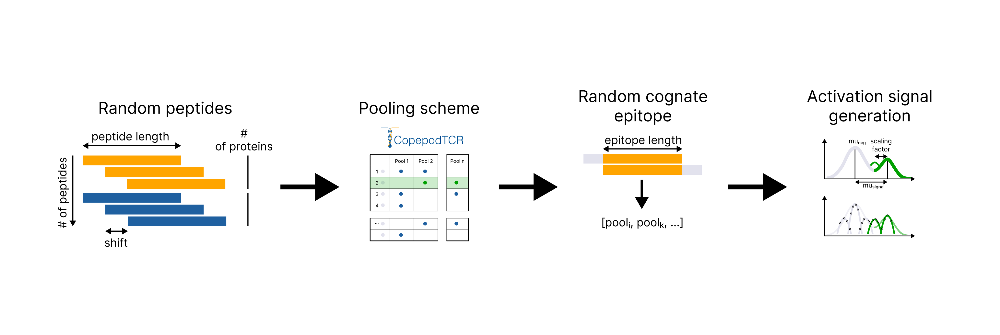

Usage
=====

.. code-block:: python

   import copepodTCR as cpp

For basic workflows, start with **Quickstart**. For details on individual functions, see the later sections and function reference.

.. _quickstart-section:

Quickstart
----------

To generate a CPP scheme and STL mask files:

.. code-block:: python

   import copepodTCR as cpp
   import codepub as cdp
   import pandas as pd

   # [Optional] set random seed
   cdp.set_seed(123)
   cpp.set_seed(123)

   # number of pools
   n_pools = 12
   # peptide occurrence
   iters = 4
   # number of peptides
   len_lst = 253
   # expected epitope length
   ep_length = 8
   # shift between overlapping peptides
   peptide_shift = 5

   # address arrangement
   b, lines = cdp.bba(m=n_pools, r=iters, n=len_lst)

   # If you have many peptides, use the faster address-arrangement function:
   ## b, lines = cdp.rcbba(m=n_pools, r=iters, n=len_lst)

   # add your peptides to lst
   lst = pd.read_csv('peptides.csv', sep = "\t")['Peptide'].tolist()

   # pooling scheme generation
   pools, peptide_address = cpp.pooling(lst=lst, addresses=lines, n_pools=n_pools)

   # save these files
   pools_df = pd.DataFrame({'Pool': list(pools.keys()), 'Peptides': [';'.join(val) for val in pools.values()]})
   peptide_address_df = pd.DataFrame(list(peptide_address.items()), columns=['Peptide', 'Address'])
   pools_df.to_csv('path/to/pools.tsv', sep = '\t', index = None)
   peptide_address_df.to_csv('path/to/peptide_addresses.tsv', sep = '\t', index = None)

   # simulation
   check_results = cpp.run_experiment(lst=lst, peptide_address=peptide_address, ep_length=ep_length, pools=pools, iters=iters, n_pools=n_pools, regime='without dropouts')
   # save this file
   check_results.to_csv('path/to/check_results.tsv', sep = "\t", index = None)

   # STL files generation
   # add peptide scheme to peptides_table_stl, with header and index as column and row numbers
   peptides_table_stl = pd.read_csv('peptides_scheme.tsv', sep = "\t", index_col = 0)
   pools_df = pd.DataFrame({'Peptides': [';'.join(val) for val in pools.values()]}, index=pools.keys())

   # now you need to select the engine, pick_engine function should help with that
   # default engine is manifold3d
   ENGINE = cpp.pick_engine()

   meshes_list = cpp.pools_stl(peptides_table = peptides_table_stl, pools = pools_df, rows = 16, cols = 24, length = 122.10, width = 79.97,
              thickness = 1.5, hole_radius = 2, x_offset = 9.05, y_offset = 6.20, well_spacing = 4.5, engine = ENGINE)
   cpp.zip_meshes_export(meshes_list)

To analyze results:

``neg_share`` is the prior expected fraction of non-activated pools. If the pooling design predicts that one epitope activates ``iters + e - 1`` pools, estimate it as ``(n_pools - iters - e + 1) / n_pools``. If unknown, ``activation_model`` uses ``0.5``.

.. code-block:: python

   # import your saved CPP simulation table
   check_results = pd.read_csv('path/to/check_results.tsv', sep = "\t")
   # peptides
   lst = pd.read_csv('peptides.csv', sep = "\t")['Peptide'].tolist()
   # number of pools
   n_pools = 12
   # peptide occurrence
   iters = 4
   # expected epitope length
   ep_length = 8
   # for plotting functions
   peptide_shift = 5

   # results of the experiment as a table with two columns, Pool and Percentage. Activation signal is expressed in percentaged of activated T cells.
   exp_results = pd.read_csv('path/to/your/file')
   cells = list(exp_results['Percentage'])
   inds = list(exp_results['Pool'])

   # also here you can enter your negative control values:
   neg_control = pd.read_csv('path/to/your/neg_control')['Percentage'].tolist()

   t, r = cpp.how_many_peptides(lst, ep_length)
   e = max(t, key=t.get)
   neg_share = (n_pools - iters - e + 1)/n_pools

   # Model
   model, ax, probs, n_c, pp, pn = cpp.activation_model(cells, n_pools, inds, neg_control, neg_share = neg_share)
   peptide_probs = cpp.peptide_probabilities(check_results, probs)
   n_act_pools, message, most, possible = cpp.results_analysis(peptide_probs, probs, check_results)
   print(message)
   print(most)
   print(possible)

   # Plotting results

   # log10 of percentage of activated T cells per pool
   cpp.poolplot(probs, cells, inds, most)

   # interactive version of the bubbleplot, with each peptide = 1 bubble, its size represents
   # difference between number of activated and non-activated pools in its address,
   # X-axis: position of peptide in the protein,
   # Y-axis: peptide probability
   import plotly.io as pio
   pio.renderers.default = "notebook_connected"
   fig = cpp.hover_bubbleplot(peptide_probs, peptide_shift=peptide_shift)
   fig.show()

   ## if interactive version is not displayed, you can check usual bubbleplot:
   cpp.bubbleplot(peptide_probs, peptide_shift=peptide_shift)

.. _quickstartf-section:

More detailed quickstart
------------------------

1. (Optional) **To be able to reproduce your results later, you can set random seed.**

   .. note:: A random seed is an initialization value that determines the sequence of numbers generated by a pseudorandom number generator.

      * Without setting a seed, each execution of a code will produce a different sequence of results, even if the code is identical, because the generator is seeded differently each time.

      * If a seed is set once in an earlier cell in Jupyter notebook and that cell is not rerun, then repeatedly executing a later cell will continue the sequence from where the generator last left off, producing different results each time.

      * However, if the same random seed is explicitly set at the start of every cell, the generator will restart from the same point, producing identical and reproducible results on every run.

   .. code-block:: python

      >>> cpp.set_seed(123)
      >>> cdp.set_seed(123)

2. (Optional) **Generate your peptides from a protein of interest.** 

   .. function:: cpp.peptide_generation(protein, peptide_length, peptide_shift, protein_end=False) -> list
      :noindex:

      :param protein: a single protein sequence (string) or a list of protein sequences
      :type protein: str or list of str

      :param peptide_length: length of each generated peptide
      :type peptide_length: int

      :param peptide_shift: number of positions to shift between consecutive peptides (i.e., peptide_length - overlap)
      :type peptide_shift: int

      :param protein_end: whether to include trailing peptide if protein ends with a short fragment
      :type protein_end: bool, default is False

      :return: list of generated peptide sequences
      :rtype: list of str

      .. code-block:: python

         >>> peptides = cpp.peptide_generation("MKWVTFISLLFLFSSAYSRGVFRRDTHKSEIAHRFKDLGE", 9, 4)
         >>> peptides[:3]
         ['MKWVTFISL', 'TFISLLFLF', 'LLFLFSSAY']

      .. note::
         - If the input is a list of proteins, the peptides will be generated for each individually and concatenated.
         - If protein_end is True, peptides near the C-terminus will be padded by upstream sequence if shorter than expected.
         - If protein_end is True and a protein is shorter than peptide_length, no peptide is generated for this protein and a warning is raised.

3. (Optional) **Check your peptide list for overlap consistency.**

   .. note:: Inconsistent overlap length can make result interpretation harder.

   You can check all peptides for their overlap length with the next
   peptide (list of peptides should be ordered):

   .. function:: cpp.all_overlaps(lst) -> Counter object
      :noindex:

      :param lst: ordered list of peptides
      :type lst: list
      :return: Counter with overlap lengths as keys and numbers of consecutive peptide pairs as values
      :rtype: Counter object

      .. note::
         If more than one overlap length is detected, the function returns the Counter and raises a warning about inconsistent overlap.

      .. code-block:: python

         >>> cpp.all_overlaps(lst)
         Counter({12: 251, 16: 1})

   => 251 consecutive peptide pairs have a 12-aa overlap, and 1 pair has a 16-aa overlap.

   Also, you can check which peptides have such an overlap with the next
   peptide:

   .. function:: cpp.find_pair_with_overlap(strings, target_overlap) -> list
      :noindex:

      :param strings: ordered list of peptides
      :type strings: list
      :param target_overlap: overlap length
      :type target_overlap: int
      :return: list of lists with peptides with specified overlap length.
      :rtype: list

      .. code-block:: python

         >>> cpp.find_pair_with_overlap(lst, 16)
         [['FDEDDSEPVLKGVKLHY', 'DEDDSEPVLKGVKLHYT']]

   => Overlap of length 16 amino acids is in peptides *FDEDDSEPVLKGVKLHY* and *DEDDSEPVLKGVKLHYT*.

   Also, you can check what number of peptides share the same epitope.
   It might help to interpret the results later.
   This count helps estimate how many pools should be activated by one cognate epitope: peptide occurrence plus one additional pool for each additional peptide sharing the same epitope.

   .. function:: cpp.how_many_peptides(lst, ep_length) -> Counter object, dictionary
      :noindex:

      :param lst: ordered list of peptides
      :type lst: list
      :param ep_length: expected epitope length
      :type ep_length: int
      :return:
         1) the Counter object with the number of epitopes shared across the number of peptides;
         2) the dictionary with all possible epitopes of expected length as keys and the number of peptides where these epitopes are present as values.
      :rtype: Counter object, dictionary

      .. code-block:: python

         >>> t, r = cpp.how_many_peptides(lst, 8)
         >>> t
         Counter({1: 6, 2: 1256, 3: 4})
         >>> r
         {'MFVFLVLL': 1, 'FVFLVLLP': 1, 'VFLVLLPL': 1, ...}

   => There are 6 epitopes present in a single peptide, 1256 epitopes present shared by two peptides, and 4 epitopes shared by 4 peptides. For each epitope, number of peptides sharing it is in the dictionary.

4. (Optional) **Determine peptide occurrence: the number of pools to which a single peptide is added.**

   .. note:: Peptide occurrence affects number of peptides in one pool, and therefore too high peptide occurrence may lead to higher dilution of a single peptide.

   .. function:: cpp.find_possible_k_values(n, l) -> list
      :noindex:

      :param n: number of pools
      :type n: int
      :param l: number of peptides
      :type l: int
      :return: list with possible peptide occurrences given number of pools and number of peptides.
      :rtype: list

      .. code-block:: python

         >>> cpp.find_possible_k_values(12, 250)
         [4, 5, 6, 7, 8]

   => Given 12 pools and 250 peptides, you can use peptide occurrence equal to 4, 5, 6, 7, 8.

   Choose one occurrence value appropriate for your task and proceed.

5. **Now, you need to find the address arrangement given your number of pools, number of peptides, and peptide occurrence.**

   Address arrangements are generated by the separate **codepub** package. Use ``cdp.bba`` for reliable search, or ``cdp.rcbba`` for faster search with large peptide sets. Codepub documentation is available here: `CodePUB readthedocs <https://codepub.readthedocs.io/en/latest/Introduction.html>`_

   .. note:: With large parameters, the algorithm needs some time to finish the arrangement. If the arrangement fails, try with other parameters.

   .. function:: bba(m, r, n, start_a = None, W_des = None) -> list, list
      :noindex:

      .. note:: Search for arrangement may take some time, especially with large parameters. This function is **slower** than :func:`cdp.rcbba`, but is more reliable.

      :param m: number of pools
      :type m: int
      :param r: address weight, i.e. to how many pools one item is added
      :type r: int
      :param n: number of items
      :type n: int
      :param start_a: desired first address of the arrangement, optional
      :type start_a: str
      :param W_des: desired balance for the resulting arrangement
      :type W_des: list, optional
      :return:
         1) list with number of item in each pool, i.e. balance;
         2) list with address arrangement
      :rtype: list, list

      .. code-block:: python

         >>> balance, lines = cdp.bba(m=12, r=4, n=250)
         >>> balance
         [81, 85, 85, 85, 81, 82, 87, 81, 85, 81, 84, 83]
         >>> lines
         [[0, 1, 2, 3],[0, 1, 3, 6],[0, 1, 6, 8],[1, 6, 8, 9],[6, 8, 9, 11], ... ]

   => You will get the expected number of peptides in each pool and address arrangement, which will be used in following steps.

6. **Now, you can distribute peptides across pools using the produced address arrangement. One peptide will be added to one produced address.**

   .. note:: Keep in mind that peptides should be ordered as they overlap.

   .. function:: cpp.pooling(lst, addresses, n_pools) -> dictionary, dictionary
      :noindex:

      :param lst: ordered list with peptides
      :type lst: list
      :param addresses: produced address arrangement
      :type addresses: list
      :param n_pools: number of pools
      :type n_pools: int
      :return:
         1) pools -- dictionary with keys as pools indices and values as peptides that should be added to each pool;
         2) peptide address -- dictionary with peptides as keys and corresponding addresses as values.
      :rtype: dictionary, dictionary

      .. code-block:: python

         >>> pools, peptide_address = cpp.pooling(lst=lst, addresses=lines, n_pools=12)
         >>> pools
         {0: ['MFVFLVLLPLVSSQCVN','VLLPLVSSQCVNLTTRT',VSSQCVNLTTRTQLPPA', ...], 1: ['MFVFLVLLPLVSSQCVN','VLLPLVSSQCVNLTTRT','TQDLFLPFFSNVTWFHA', ...], ... }
         >>> peptide_address
         {'MFVFLVLLPLVSSQCVN': [0, 1, 2, 3], 'VLLPLVSSQCVNLTTRT': [0, 1, 2, 10], ... }

   => You will get the pooling scheme and peptide addresses. Don't forget to save these files!

7. **Now, you can run the simulation using produced pools and peptide_address.**

   The simulation produces a DataFrame with every possible epitope of the provided length and all pools where this epitope is present. This table is needed to interpret the results.

   The function has two regimes. ``without dropouts`` assumes all expected pools are activated. ``with dropouts`` enumerates possible false-negative pool patterns, where pools that should be activated are missing from the observed activation set.

   .. note:: "With drop-outs" regime is needed only on very special cases, for example, for calculation of robustness of the scheme to experimental errors.

   .. function:: cpp.run_experiment(lst, peptide_address, ep_length, pools, iters, n_pools, regime) -> pandas DataFrame
      :noindex:

      .. note:: Simulation may take several minutes, especially upon "with drop-outs" regime.

      :param lst: ordered list with peptides
      :type lst: list
      :param peptide_address: peptides addresses produced by pooling
      :type peptide_address: dictionary
      :param ep_length: expected epitope length
      :type ep_length: int
      :param pools: pools produced by pooling
      :type pools: dictionary
      :param iters: peptide occurrence
      :type iters: int
      :param n_pools: number of pools
      :type n_pools: int
      :param regime: regime of simulation, with or without drop-outs
      :type regime: “with dropouts” or “without dropouts”
      :return:
         pandas DataFrame with all possible epitopes of given length and the resulting activated pools
      :rtype: pandas DataFrame

      .. code-block:: python

         >>> df = cpp.run_experiment(lst=lst, peptide_address=peptide_address, ep_length=8, pools=pools, iters=iters, n_pools=n_pools, regime='without dropouts')

   .. code-block:: python

      >>> df

   .. table::
      :widths: 10 10 10 10 10 10 10 10 10 10 10

      +-------------------+---------------+----------+------------------+------------+---------------+---------------+----------+-----------+---------------+---------------+
      | Peptide           | Address       | Epitope  | Act Pools        | # of pools | # of epitopes | # of peptides | Remained | # of lost | Right peptide | Right epitope |
      +===================+===============+==========+==================+============+===============+===============+==========+===========+===============+===============+
      | MFVFLVLLPLVSSQCVN | [0, 1, 2, 3]  | MFVFLVLL | [0, 1, 2, 3]     | 4          | 5             | 1             | --       | 0         | True          | True          |
      +-------------------+---------------+----------+------------------+------------+---------------+---------------+----------+-----------+---------------+---------------+
      | MFVFLVLLPLVSSQCVN | [0, 1, 2, 3]  | MFVFLVLL | [0, 1, 2, 3]     | 4          | 5             | 1             | --       | 0         | True          | True          |
      +-------------------+---------------+----------+------------------+------------+---------------+---------------+----------+-----------+---------------+---------------+
      | …                 |               |          |                  |            |               |               |          |           |               |               |
      +-------------------+---------------+----------+------------------+------------+---------------+---------------+----------+-----------+---------------+---------------+
      | MFVFLVLLPLVSSQCVN | [0, 1, 2, 3]  | VLLPLVSS | [0, 1, 2, 3, 10] | 5          | 5             | 2             | --       | 0         | True          | True          |
      +-------------------+---------------+----------+------------------+------------+---------------+---------------+----------+-----------+---------------+---------------+
      | …                 |               |          |                  |            |               |               |          |           |               |               |
      +-------------------+---------------+----------+------------------+------------+---------------+---------------+----------+-----------+---------------+---------------+
      | VLLPLVSSQCVNLTTRT | [0, 1, 2, 10] | VLLPLVSS | [0, 1, 2, 3, 10] | 5          | 5             | 2             | --       | 0         | True          | True          |
      +-------------------+---------------+----------+------------------+------------+---------------+---------------+----------+-----------+---------------+---------------+
      | …                 |               |          |                  |            |               |               |          |           |               |               |
      +-------------------+---------------+----------+------------------+------------+---------------+---------------+----------+-----------+---------------+---------------+

   **Peptide** — peptide sequence

   **Address** — pool indices where this peptide should be added

   **Epitope** — checked epitope from this peptide

   **Act pools** — list with pool indices where this epitope is present

   **# of pools** — number of pools where this epitope is present

   **# of epitopes** — number of epitopes that are present in the same pools (= number of possible peptides upon activation of such pools)

   **# of peptides** — number of peptides in which there are epitopes that are present in the same pools (= number of possible peptides upon activation of such pools)

   **Remained** — in ``with dropouts`` mode, the subset of activated pools retained after simulated drop-outs.

   **# of lost** — only upon regime=”with dropouts”, number of dropped pools due to mistake

   **Right peptide** — True or False, whether the peptide is present in the list of possible peptides

   **Right epitope** — True or False, whether the peptide is present in the list of possible peptides

   Save resulting table, it will be required for results interpretation.

   .. tip:: This table can be used to interpret experimental results without the Bayesian mixture model. See :func:`cpp.run_experiment` for details.

7. (Optional) **Generate 3D-printable masks.**

   To reduce manual pooling errors, copepodTCR can generate one 3D-printable mask per pool. Each mask has holes at the peptide positions that can be used to organize tips into required patterns.

   Example mask workflow: `video/photo link <https://drive.google.com/file/d/1wtLNnKj8I7iYdlu1owY5Cl4SegYcouei/view?usp=sharing>`_.

   .. note:: The rendering of 3D models is a long process, so it could take time.

   Before generating masks, choose an available boolean-operation engine. ``manifold3d`` is the default; Blender can be used if available.

   .. code-block:: python

      >>> ENGINE = cpp.pick_engine()

   Now ENGINE should be passed as argument to the next function:

   .. function:: cpp.pools_stl(peptides_table, pools, engine, rows = 16, cols = 24, length = 122.10, width = 79.97, thickness = 1.5, hole_radius = 4.0 / 2, x_offset = 9.05, y_offset = 6.20, well_spacing = 4.5, hole16 = False) -> dictionary
      :noindex:

      :param peptides_table: table representing the arrangement of peptides in a plate, is not produced by any function in the package
      :type peptides_table: pandas DataFrame
      :param pools: table with a pooling scheme, where one row represents each pool, pool index is the index column, and a string with all peptides added to this pool separated by “;” is “Peptides” column.
      :type pools: pandas DataFrame
      :param engine: engine for trimesh.boolean.union() and trimesh.difference(), "manifold"
      :type engine: str
      :param rows: int
      :type rows: int
      :param cols: number of columns in your plate with peptides
      :type cols: int
      :param length: length of the plate in mm
      :type length: float
      :param width: width of the plate in mm
      :type width: float
      :param thickness: desired thickness of the mask, in mm
      :type thickness: float
      :param hole_radius: the radius of the holes, in mm, should be adjusted to fit your tip
      :type hole_radius: float
      :param x_offset: the margin along the X axis for the A1 hole, in mm
      :type x_offset: float
      :param y_offset: the margin along the Y axis for the A1 hole, in mm
      :type y_offset: float
      :param well_spacing: the distance between wells, in mm
      :type well_spacing: float
      :param hole16: whether to add a hole at position 16, 24
      :type hole16: bool
      :return: dictionary with Mesh objects, where key is pool index, and value is a Mesh object of a corresponding mask
      :rtype: dictionary

      .. code-block:: python

         >>> meshes_list = cpp.pools_stl(peptides_table, pools, engine = ENGINE, rows = 16, cols = 24, length = 122.10, width = 79.97, thickness = 1.5, hole_radius = 2.0, x_offset = 9.05, y_offset = 6.20, well_spacing = 4.5)

   Now, you need to pass generated dictionary to the function exporting it as a .zip file.

   .. function:: cpp.zip_meshes_export(meshes_list) -> None
      :noindex:

      :param meshes_list: dictionary with Mesh objects, generated in previous step
      :type meshes_list: dictionary
      :return: export Mesh objects as STL files in .zip archive.
      :rtype: None

      .. code-block:: python

         >>> cpp.zip_meshes_export(meshes_list)

   => You will get a .zip archive with generated STL files. Then, you can send these STL files directly to a 3D printer. Generated masks have small marks at the top representing the index of the pool. Also, you can check generated STL files using any program that can open STL files (for example, OpenSCAD).

8. **To interpret the results, you can use the Bayesian mixture model of activation signal.**
   
   Plate notation for the model (for 12 pools and 3 replicates).

   .. image:: model_scheme.png
      :width: 600px
      :align: center

   .. function:: cpp.activation_model(obs, n_pools, inds, neg_control=None, neg_share=None, cores=1) -> model, ax, pandas DataFrame, numpy array, InferenceData, list
      :noindex:

      .. note:: Fitting might take several minutes.

      :param obs: list with observed values
      :type obs: list
      :param n_pools: number of pools
      :type n_pools: int
      :param inds: list with indices for observed values
      :type inds: list
      :param neg_control: optional list with negative control values; if not provided, values from the pool with the lowest mean observed signal are used
      :type neg_control: list or None
      :param neg_share: expected share of negative pools (between 0 and 1); default is 0.5
      :type neg_share: float or None
      :param cores: number of CPU cores to use for MCMC sampling
      :type cores: int
      :return:
         1) model -- PyMC model object used for fitting  
         2) ax -- posterior predictive KDE and observed data KDE (ArviZ)
         3) probs -- probability for each pool of being drawn from a distribution of activated or non-activated pools
         4) neg_control -- normalized control values used in model
         5) idata_alt -- full posterior sampling trace (InferenceData object)
         6) [p_mean, n_mean] -- posterior mean of the offset and baseline (negative) component
      :rtype: model, axes, pandas DataFrame, numpy array, arviz.InferenceData, list

      ``neg_share`` is the prior expectation for the share of pools that should be non-activated. If one epitope is expected to activate ``iters + e - 1`` pools, where ``e`` is the modal number of peptides sharing the same epitope from :func:`cpp.how_many_peptides`, it can be estimated as ``(n_pools - iters - e + 1) / n_pools``. If this value is unknown, the model uses ``0.5`` by default.

      .. code-block:: python

         >>> model, ax, probs, neg_control, trace, [p_mean, n_mean] = cpp.activation_model(obs, 12, inds)

      .. image:: model_fit.png

      .. code-block:: python

         >>> probs

      .. table::
         :widths: 10 10

         +------+---------+
         | Pool | assign  |
         +======+=========+
         | 0    | 0.99900 |
         +------+---------+
         | 1    | 1.00000 |
         +------+---------+
         | 2    | 0.00025 |
         +------+---------+
         | 3    | 0.36475 |
         +------+---------+
         | 4    | 0.00025 |
         +------+---------+
         | 5    | 0.00000 |
         +------+---------+
         | 6    | 1.00000 |
         +------+---------+
         | 7    | 1.00000 |
         +------+---------+
         | 8    | 0.99975 |
         +------+---------+
         | 9    | 0.99975 |
         +------+---------+
         | 10   | 0.00000 |
         +------+---------+
         | 11   | 0.99975 |
         +------+---------+

   The **assign** column is the posterior probability that a pool belongs to the non-activated component. Pools with ``assign <= 0.5`` are treated as activated.

   Using this table, you can assess which pools were activated and which were not, and then check the result in check_results table with simulation. However, also you can use the following functions:

   .. function:: cpp.peptide_probabilities(sim, probs) -> pandas DataFrame
      :noindex:

      :param sim: check_results table with simulation with or without drop-outs
      :type sim: pandas DataFrame
      :param probs: DataFrame with probabilities produced by :func:`cpp.activation_model`
      :type probs: pandas DataFrame
      :return: peptide_probs -- probability for each peptide to cause such a pattern of activation
      :rtype: pandas DataFrame

      .. code-block:: python

         >>> peptide_probs = cpp.peptide_probabilities(sim, probs)

      .. code-block:: python

         >>> peptide_probs

      .. table::
         :widths: 10 10 10 10 10 10

         +-------------------+---------------+--------------------+--------------+-----------+---------------+
         | Peptide           | Address       | Act Pools          | Probability  | Activated | Non-Activated |
         +===================+===============+====================+==============+===========+===============+
         | MFVFLVLLPLVSSQCVN | [0, 1, 2, 3]  | [0, 1, 2, 3]       | 1.172135e-07 | 2         | 2             |
         +-------------------+---------------+--------------------+--------------+-----------+---------------+
         | MFVFLVLLPLVSSQCVN | [0, 1, 2, 3]  | [0, 1, 2, 3, 7]    | 8.262788e-10 | 2         | 2             |
         +-------------------+---------------+--------------------+--------------+-----------+---------------+
         | VLLPLVSSQCVNLTTRT | [1, 2, 3, 7]  | [0, 1, 2, 3, 7]    | 8.262788e-10 | 2         | 2             |
         +-------------------+---------------+--------------------+--------------+-----------+---------------+
         | VLLPLVSSQCVNLTTRT | [1, 2, 3, 7]  | [1, 2, 3, 7, 11]   | 2.119434e-05 | 3         | 3             |
         +-------------------+---------------+--------------------+--------------+-----------+---------------+
         | VSSQCVNLTTRTQLPPA | [2, 3, 7, 11] | [1, 2, 3, 7, 11]   | 2.119434e-05 | 3         | 3             |
         +-------------------+---------------+--------------------+--------------+-----------+---------------+
         | ...               | ...           | ...                | ...          | ...       | ...           |
         +-------------------+---------------+--------------------+--------------+-----------+---------------+
         | FDEDDSEPVLKGVKLHY | [0, 1, 3, 5]  | [0, 1, 2, 3, 4, 5] | 3.259596e-08 | 3         | 3             |
         +-------------------+---------------+--------------------+--------------+-----------+---------------+
         | FDEDDSEPVLKGVKLHY | [0, 1, 3, 5]  | [0, 1, 2, 3, 5]    | 2.104844e-06 | 3         | 2             |
         +-------------------+---------------+--------------------+--------------+-----------+---------------+
         | DEDDSEPVLKGVKLHYT | [0, 1, 2, 5]  | [0, 1, 2, 3, 4, 5] | 3.259596e-08 | 3         | 3             |
         +-------------------+---------------+--------------------+--------------+-----------+---------------+
         | DEDDSEPVLKGVKLHYT | [0, 1, 2, 5]  | [0, 1, 2, 3, 5]    | 2.104844e-06 | 3         | 2             |
         +-------------------+---------------+--------------------+--------------+-----------+---------------+
         | DEDDSEPVLKGVKLHYT | [0, 1, 2, 5]  | [0, 1, 2, 5]       | 7.922877e-09 | 2         | 2             |
         +-------------------+---------------+--------------------+--------------+-----------+---------------+

   And then this table can be used to find cognate peptides:

   .. function:: cpp.results_analysis(peptide_probs, probs, sim) -> int, str, list, list
      :noindex:

      :param peptide_probs: DataFrame with probabilities for each peptide produced by :func:`cpp.peptide_probabilities`
      :type peptide_probs: pandas DataFrame
      :param probs: DataFrame with probabilities produced by :func:`cpp.activation_model`
      :type probs: pandas DataFrame
      :param sim: check_results table with simulation with or without drop-outs
      :type sim: pandas DataFrame
      :return:
         1) number of activated pools
         2) note about detected drop-outs (erroneously non-activated pools);
         3) list of the most possible peptides;
         4) list of all possible peptides given this pattern of pools activation.
      :rtype: int, str, list, list

      .. code-block:: python

         >>> n_act_pools, note, most, possible = cpp.results_analysis(peptide_probs, probs, sim)
         >>> n_act_pools
         5
         >>> note
         No drop-outs were detected
         >>> most
         ['SSANNCTFEYVSQPFLM', 'CTFEYVSQPFLMDLEGK']
         >>> possible
         ['SSANNCTFEYVSQPFLM', 'CTFEYVSQPFLMDLEGK']

9. **Plotting results.**

   You can visualize results with copepodTCR plotting functions.

   **Bubbleplot**
   Each bubble represents one peptide. Bubble size is the number of activated pools in the peptide address minus the number of non-activated pools; peptides with non-positive values are not shown. X-axis: position of a peptide in protein. Y-axis: its probability.

   .. code-block:: python

      >>> cpp.bubbleplot(peptide_probs, peptide_shift=5)

   .. image:: bubble_plot.png

   Or using interactive version of this bubbleplot (with plotly):

   .. code-block:: python

      >>> import plotly.io as pio
      >>> pio.renderers.default = "notebook_connected"
      >>> cpp.hover_bubbleplot(peptide_probs, peptide_shift=5)

   **Scatterplot for pools**
   Also you make a scatterplot with pools. Each dot is one replicate, with its pool index on X-axis and its log10 percentage of activated T cells on Y-axis. Pools identified by the activation model as activated are plotted green, others pools are gray.

   .. code-block:: python

      >>> cpp.poolplot(probs, cells, inds, most)

   .. image:: pool_plot.png

.. _simulation-section:

Play with the approach using simulated data (Optional)
-------------------------------------------------------

To explore the workflow with simulated data, use the following pipeline.

1. **First, you need to determine the parameters for pooling scheme.**

   * how many peptides? (len_lst)

   * how many pools? (n_pools)

   * what is peptide occurrence, i.e. to how many pools one peptide would be added? (iters)

   * what would be the length of the peptide? (pep_length)

   * what is the length of the shift between two overlapping peptides? (shift)

   * what is the length of the expected epitope (ep_length, we recommend 8)

2. **Then, you can use these parameters to generate peptides. First, you would need to generate a random sequence, and then you could generate peptides using a sliding window approach.**
   
   .. code-block:: python

      import codepub as cdp
      import copepodTCR as cpp

      >>> len_lst = 100
      >>> n_pools = 12
      >>> iters = 4
      >>> pep_length = 17
      >>> shift = 5
      >>> ep_length = 8

      >>> sequence = cpp.random_amino_acid_sequence(shift*len_lst + (100-shift*len_lst%100))
      >>> sequence
         'EMKFLDQSQLGYVHPKWHHGTEMDEWSRSNSAYGKHQEATRLCSQWWVKTYMPTDPCWMLRYTNCCAMVPRYADFCMRDYRYAYIYFVNWNHECSDVIMETCCFALGKKLSTPTCTPGCVTVIYECKSEFEVGWPPHIIEGSAEFYAVACFVTRFMCPQTKANLLKIIISFHLHHYGQAEQICYKNEIPCCAMKFFDHREGLESNCLTCMQWPCNKSLFDPFPVMYRFSMAGNQGEPPCGYAVTMNARCTMGRWQKFRCEFKGCFYHNINVYTGCETMHECQIPVPMVHQTTLLYPCNVRSKDIDPCDWSYLEDDKERGWCGKFQMGSQIFRKFTPPPWTNRGWNHMDDTEARHRWCLTWKFTLDEPAEDTCILWIHSVYLWVVCMQGTAMSMRMVSFTLLCFMRAPPCEVMHYCDPQQTRDEELPMVGYITEELKSMFTSSSWPGSQSPGWGTWDLSIKRHSVKVPDMINPTHVVKPTKCICNQSLGWTFSEIDMYARHDIQKRWKCPIWNGQFRYEVIHSKQNPFQNSDEQPT'

   The sequence is generated slightly longer than needed so that slicing the first ``len_lst`` peptides after peptide generation produces enough peptides.

   .. code-block:: python

      ## Then with this sequence you can generate peptides
      >>> lst_all = cpp.peptide_generation(sequence, pep_length, shift)
      >>> lst = lst_all[:len_lst]

3. **Then you can finally generate the pooling scheme.**

   .. code-block:: python

      >>> b, lines = cdp.bba(m=n_pools, r=iters, n=len_lst)
      >>> pools, peptide_address = cpp.pooling(lst=lst, addresses=lines, n_pools=n_pools)
      >>> check_results = cpp.run_experiment(lst=lst, peptide_address=peptide_address, ep_length=ep_length, pools=pools, iters=iters, n_pools=n_pools, regime='without dropouts')

4. **Select a cognate epitope to test whether the model can recover it. You can choose one manually or sample one at random.**

   .. code-block:: python

      >>> cognate = check_results.sample(1)['Epitope'][0]
      >>> check_results['Cognate'] = False
      >>> check_results.loc[check_results['Epitope'] == cognate, 'Cognate'] = True   
      >>> print(list(set(check_results['Peptide'][check_results['Epitope'] == cognate])))
      ['YCNQNWDWDMCEVVCGR', 'WDWDMCEVVCGRDFCHC']

   Also, you would need to find the pools which would be activated given this epitope is cognate.

   .. code-block:: python

      >>> inds_p_check = check_results[check_results['Cognate'] == True]['Act Pools'].values[0]

      >>> inds_p_check = [int(x) for x in inds_p_check[1:-1].split(', ')]
      >>> inds_n_check = []
      >>> for item in range(n_pools):
            if item not in inds_p_check:
               inds_n_check.append(item)
      >>> print(inds_p_check)
      [5, 6, 9, 10, 11]
      >>> print(inds_n_check)
      [0, 1, 2, 3, 4, 7, 8]

5. **Then you can simulate activation signal. For that, you would need to determine parameters of the model.**

   Plate notation for the simulation model:

   .. image:: model_simulation.png

   * mu_n -- mean of the non-activated pool signal distribution, ranges from 0 to 100.

   * sigma_n -- standard deviation of the non-activated pool signal distribution, ranges from 0 to 100.

   * mu_off -- mean of the positive-signal offset, ranges from 0 to 100.

   * sigma_off -- standard deviation of the positive-signal offset, ranges from 0 to 100.

   * r -- number of replicates in the experiment.

   * sigma_p_r -- standard deviation of replicate variability for positive-distribution measurements, ranges from 0 to 100.

   * sigma_n_r -- standard deviation of replicate variability for negative-distribution measurements, ranges from 0 to 100.

   * n_pools -- number of pools.

   * p_shape -- number of activated pools in simulation; this can equal the number of pools where the cognate epitope is present, or it can be higher or lower to test how the algorithm responds to mistakes.

   * pl_shape -- number of slightly activated pools in simulation corresponding to context-dependent activation. For simplicity, we recommend setting it to 0.

   * low_offset -- the degree to which activation is decreased in pools from ``pl_shape``, ranges from 0 to 1. We recommend setting it to 1, then it will not be applied.

   .. code-block:: python

      >>> mu_off = 60
      >>> sigma_off = 3
      >>> mu_n = 20
      >>> sigma_n = 3
      >>> r = 1
      >>> sigma_p_r = 3
      >>> sigma_n_r = 3
      >>> n_pools = 12
      >>> p_shape = len(inds_p_check)  
      >>> pl_shape = 0
      >>> low_offset = 1

   .. code-block:: python

      >>> p_results, pl_results, n_results, n_control, parameters = cpp.simulation(mu_off, sigma_off, mu_n, sigma_n, r, sigma_p_r, sigma_n_r, n_pools, p_shape, pl_shape, low_offset)
      >>> cells = pd.DataFrame(columns = ['Pool', 'Percentage'])
      >>> cells['Percentage'] = p_results + n_results
      >>> cells['Pool'] = inds_p_check*r + inds_n_check*r

   Because ``pl_shape = 0`` in this example, ``pl_results`` is empty and is not added to ``cells``.

   Cells is a DataFrame with the simulated data:

   .. code-block:: python

      >>> cells

   .. table::
      :widths: 10 10

      +------+------------+
      | Pool | Percentage |
      +======+============+
      | 5    | 14.554757  |
      +------+------------+
      | 6    | 14.818329  |
      +------+------------+
      | 9    | 14.846125  |
      +------+------------+
      | 10   | 14.536968  |
      +------+------------+
      | 11   | 15.311202  |
      +------+------------+
      | 0    | 4.544784   |
      +------+------------+
      | 1    | 4.422958   |
      +------+------------+
      | 2    | 4.514103   |
      +------+------------+
      | 3    | 4.458392   |
      +------+------------+
      | 4    | 4.575509   |
      +------+------------+
      | 7    | 5.791510   |
      +------+------------+
      | 8    | 5.334201   |
      +------+------------+

6. **Then you can use this table to check the algorithm.**

   .. code-block:: python

      >>> inds = list(cells['Pool'])
      >>> obs = list(cells['Percentage'])
      >>> model, ax, probs, neg_control, trace, [p_mean, n_mean] = cpp.activation_model(obs, n_pools, inds)
      >>> peptide_probs = cpp.peptide_probabilities(check_results, probs)
      >>> n_act_pools, message, most, possible = cpp.results_analysis(peptide_probs, probs, check_results)
      >>> n_act_pools
      5
      >>> message
      'No drop-outs were detected'
      >>> most
      ['YCNQNWDWDMCEVVCGR', 'WDWDMCEVVCGRDFCHC']
      >>> possible
      ['YCNQNWDWDMCEVVCGR', 'WDWDMCEVVCGRDFCHC']

   Now you can compare recovered cognate peptides with ones you chose:

   * ['YCNQNWDWDMCEVVCGR', 'WDWDMCEVVCGRDFCHC'] - you chose
   
   * ['YCNQNWDWDMCEVVCGR', 'WDWDMCEVVCGRDFCHC'] - were recovered by the model from the simulated activation data

7. **Also you can plot this data using built-in plotting functions.**

   .. code-block:: python

      >>> cpp.bubbleplot(peptide_probs, peptide_shift=shift)

   Or using plotly to make interactive bubbleplot:

   .. code-block:: python

      >>> import plotly.io as pio
      >>> pio.renderers.default = "notebook_connected"
      >>> cpp.hover_bubbleplot(peptide_probs, peptide_shift=shift)

   Also you can make a scatterplot with activation signal from pools:

   .. code-block:: python

      >>> cpp.poolplot(probs, cells, inds, most)

8. **You can play with different parameters to check how well the approach works.**
   
   For example, decreasing the positive-signal offset lets you test how much separation between activated and non-activated pools is needed for correct recovery.

Function reference
==================

Reproducibility
---------------

.. function:: cpp.set_seed(seed) -> None

      :param seed: random seed value
      :type seed: int
      :return: None
      :rtype: None

      .. code-block:: python

         >>> cpp.set_seed(123)

.. _occurrence-section:

Peptide occurrence search
--------------------------

.. function:: cpp.factorial(num) -> int

      :param num: number
      :type n: int
      :return: factorial of the num
      :rtype: int

      .. code-block:: python

         >>> cpp.factorial(10)
         3628800

.. function:: cpp.combination(n, k) -> int

      :param n: set length
      :type n: int
      :param k: number of selected items
      :type k: int
      :return: number of ways to choose k items from n
      :rtype: int

      .. code-block:: python

         >>> cpp.combination(10, 3)
         120

.. function:: cpp.find_possible_k_values(n, l) -> list

      :param n: number of pools
      :type n: int
      :param l: number of peptides
      :type l: int
      :return: list with possible peptide occurrences given number of pools and number of peptides.
      :rtype: Counter object, dictionary

      .. code-block:: python

         >>> cpp.find_possible_k_values(12, 250)
         [4, 5, 6, 7, 8]

.. _peptide-section:

Peptides generation and assessment
----------------------------------

.. function:: cpp.peptide_generation(protein, peptide_length, peptide_shift, protein_end=False) -> list

      :param protein: a single protein sequence (string) or a list of protein sequences
      :type protein: str or list of str

      :param peptide_length: length of each generated peptide
      :type peptide_length: int

      :param peptide_shift: number of positions to shift between consecutive peptides (i.e., peptide_length - overlap)
      :type peptide_shift: int

      :param protein_end: whether to include trailing peptide if protein ends with a short fragment
      :type protein_end: bool, default is False

      :return: list of generated peptide sequences
      :rtype: list of str

      .. code-block:: python

         >>> peptides = cpp.peptide_generation("MKWVTFISLLFLFSSAYSRGVFRRDTHKSEIAHRFKDLGE", 9, 4)
         >>> peptides[:3]
         ['MKWVTFISL', 'TFISLLFLF', 'LLFLFSSAY']

      .. note::
         - If the input is a list of proteins, the peptides will be generated for each individually and concatenated.
         - If protein_end is True, peptides near the C-terminus will be padded by upstream sequence if shorter than expected.
         - If protein_end is True and a protein is shorter than peptide_length, no peptide is generated for this protein and a warning is raised.

.. function:: cpp.string_overlap(str1, str2) -> int

      :param str1: peptide
      :type str1: string
      :param str2: peptide
      :type str2: string
      :return: overlap length between two peptides
      :rtype: int

      .. code-block:: python

         >>> cpp.string_overlap('ASDFGHJKTYUIO', 'GHJKTYUIOTYUI')
         9

.. function:: cpp.all_overlaps(strings) -> Counter object

      :param strings: ordered list of peptides
      :type strings: list
      :return: Counter with overlap lengths as keys and numbers of consecutive peptide pairs as values
      :rtype: Counter object

      .. note::
         If more than one overlap length is detected, the function returns the Counter and raises a warning about inconsistent overlap.

.. function:: cpp.find_pair_with_overlap(strings, target_overlap) -> list

      :param strings: ordered list of peptides
      :type strings: list
      :param target_overlap: overlap length
      :type target_overlap: int
      :return: list of lists with peptides with specified overlap length.
      :rtype: list

      .. code-block:: python

         >>> cpp.find_pair_with_overlap(lst, 16)
         [['FDEDDSEPVLKGVKLHY', 'DEDDSEPVLKGVKLHYT']]

.. function:: cpp.how_many_peptides(lst, ep_length) -> Counter object, dictionary

      :param lst: ordered list of peptides
      :type lst: list
      :param ep_length: expected epitope length
      :type ep_length: int
      :return:
         1) the Counter object with the number of epitopes shared across the number of peptides;
         2) the dictionary with all possible epitopes of expected length as keys and the number of peptides where these epitopes are present as values.
      :rtype: Counter object, dictionary

      .. code-block:: python

         >>> t, r = cpp.how_many_peptides(lst, 8)
         >>> t
         Counter({1: 6, 2: 1256, 3: 4})
         >>> r
         {'MFVFLVLL': 1, 'FVFLVLLP': 1, 'VFLVLLPL': 1, ...}

.. _pooling-section:

Pooling
-------

.. function:: cpp.bad_address_predictor(all_ns) -> list

      .. tip:: Keep in mind that produced arrangement might be imbalanced.

      .. note:: A bad address is detected when three consecutive addresses produce ambiguous pairwise unions. The function removes the middle address from such triples.

      :param all_ns: address arrangement
      :type all_ns: list
      :return: address arrangement without addresses with the same unions. The function searches for three consecutive addresses with the same union and removes the middle one.
      :rtype: list

      .. code-block:: python

         >>> cpp.bad_address_predictor([[0, 1, 2, 3], [0, 1, 2, 4], [0, 1, 2, 5], [0, 1, 2, 6], [0, 1, 3, 6], [0, 1, 3, 5], [0, 1, 3, 4]])
         [[0, 1, 2, 3], [0, 1, 2, 4], [0, 1, 2, 5], [0, 1, 2, 6], [0, 1, 3, 6], [0, 1, 3, 5], [0, 1, 3, 4]]

.. function:: cpp.pooling(lst, addresses, n_pools) -> dictionary, dictionary

      :param lst: ordered list with peptides
      :type lst: list
      :param addresses: produced address arrangement
      :type addresses: list
      :param n_pools: number of pools
      :type n_pools: int
      :return:
         1) pools -- dictionary with keys as pools indices and values as peptides that should be added to this pools;
         2) peptide address -- dictionary with peptides as keys and corresponding addresses as values.
      :rtype: dictionary, dictionary

      .. code-block:: python

         >>> pools, peptide_address = cpp.pooling(lst=lst, addresses=lines, n_pools=12)
         >>> pools
         {0: ['MFVFLVLLPLVSSQCVN','VLLPLVSSQCVNLTTRT',VSSQCVNLTTRTQLPPA', ...], 1: ['MFVFLVLLPLVSSQCVN','VLLPLVSSQCVNLTTRT','TQDLFLPFFSNVTWFHA', ...], ... }
         >>> peptide_address
         {'MFVFLVLLPLVSSQCVN': [0, 1, 2, 3], 'VLLPLVSSQCVNLTTRT': [0, 1, 2, 10], ... }

.. function:: cpp.pools_activation(pools, epitope) -> list

      :param pools: pools, produced by :func:`cpp.pooling`
      :type pools: dictionary
      :param epitope: epitope present in one or several tested peptides
      :type epitope: string
      :return: pool indices where the epitope is present
      :rtype: list

      .. code-block:: python

         >>> cpp.pools_activation(pools, 'LGVYYHKN')
         [0, 3, 8, 9, 11]

.. function:: cpp.epitope_pools_activation(peptide_address, lst, ep_length) -> dictionary

      :param peptide_address: peptide addresses, produced by :func:`cpp.pooling`
      :type peptide_address: dictionary
      :param lst: ordered list of peptides
      :type lst: list
      :param ep_length: expected epitope length
      :type ep_length: int
      :return: activated pools for every possible epitope of expected length from entered peptides
      :rtype: dictionary

      .. code-block:: python

         >>> cpp.epitope_pools_activation(peptide_address, lst, 8)
         {'[0, 1, 2, 3]': ['MFVFLVLL', 'FVFLVLLP', 'VFLVLLPL', 'FLVLLPLV', 'LVLLPLVS'], '[0, 1, 2, 3, 9]': ['VLLPLVSS', 'LLPLVSSQ', 'LPLVSSQC', 'PLVSSQCV', 'LVSSQCVN'], '[0, 1, 3, 9, 11]': ['VSSQCVNL', 'SSQCVNLT', ...], ... }

.. function:: cpp.peptide_search(lst, ep_length, act_profile, act_pools, iters, n_pools, regime) -> list, list

      :param lst: ordered list of peptides
      :type lst: list
      :param ep_length: expected epitope length
      :type ep_length: int
      :param act_profile: activated pools for every possible epitope of expected length from entered peptides, produced by :func:`cpp.epitope_pools_activation`
      :type act_profile: dictionary
      :param act_pools: activated pools
      :type act_pools: list
      :param iters: peptide occurrence
      :type iters: int
      :param n_pools: number of pools
      :type n_pools: int
      :param regime: regime of simulation, with or without drop-outs
      :type regime: "with dropouts" or "without dropouts"
      :return: possible peptides and possible epitopes given such activated pools
      :rtype: list, list

      .. code-block:: python

         >>> cpp.peptide_search(lst, 8, act_profile, [0, 3, 8, 9, 11], 4, 12, 'without dropouts')
         (['CNDPFLGVYYHKNNKSW', 'LGVYYHKNNKSWMESEF'], ['LGVYYHKN', 'GVYYHKNN', 'VYYHKNNK', 'YYHKNNKS', 'YHKNNKSW'])
         >>> cpp.peptide_search(lst, 8, act_profile, [0, 3, 8, 11], iters, n_pools, 'with dropouts')
         (['CNDPFLGVYYHKNNKSW', 'LLKYNENGTITDAVDCA', 'LGVYYHKNNKSWMESEF', 'QPRTFLLKYNENGTITD'], ['YNENGTIT', 'LKYNENGT', 'YHKNNKSW', 'KYNENGTI', 'YYHKNNKS', 'LGVYYHKN', 'VYYHKNNK', 'NENGTITD', 'LLKYNENG', 'GVYYHKNN'])

.. function:: cpp.run_experiment(lst, peptide_address, ep_length, pools, iters, n_pools, regime) -> pandas DataFrame

      .. note:: Simulation may take several minutes, especially upon "with drop-outs" regime.

      :param lst: ordered list with peptides
      :type lst: list
      :param peptide_address: peptides addresses produced by pooling
      :type peptide_address: dictionary
      :param ep_length: expected epitope length
      :type ep_length: int
      :param pools: pools produced by pooling
      :type pools: dictionary
      :param iters: peptide occurrence
      :type iters: int
      :param n_pools: number of pools
      :type n_pools: int
      :param regime: regime of simulation, with or without drop-outs
      :type regime: “with dropouts” or “without dropouts”
      :return:
         pandas DataFrame with simulated epitope activation patterns and peptide recovery results
      :rtype: pandas DataFrame

      .. code-block:: python

         >>> df = cpp.run_experiment(lst=lst, peptide_address=peptide_address, ep_length=8, pools=pools, iters=iters, n_pools=n_pools, regime='without dropouts')

   This table can be used to interpret experimental results without the Bayesian mixture model.

   After the experiment, the number of activated pools depends on peptide occurrence, overlap length, and expected epitope length. You can check the distribution of epitope presence in your peptides with :func:`cpp.how_many_peptides`. The expected number of activated pools is peptide occurrence plus one additional pool for each additional peptide sharing the same epitope.

   If exact activated pools are found in the table:

   -  Use those rows to identify all possible peptides and epitopes that could activate the observed pool combination.

   If fewer pools are activated than expected:

   -  The target peptide may be at the end of the peptide list, with the target epitope outside an overlap with the next peptide.
   -  The target peptide may have a shorter-than-usual overlap with its neighbor. Check this with :func:`cpp.all_overlaps` or :func:`cpp.how_many_peptides`.
   -  Some expected pools may be false negatives. In this case, use the ``with dropouts`` simulation regime.

   If more pools are activated than expected:

   -  The target peptide may have a longer-than-usual overlap with its neighbor. Check this with :func:`cpp.all_overlaps` or :func:`cpp.how_many_peptides`.
   -  Some pools may be false positives. This issue is not addressed in the package.

   .. code-block:: python

      >>> df = cpp.run_experiment(lst=lst, peptide_address=peptide_address, ep_length=8, pools=pools, iters=iters, n_pools=n_pools, regime='with dropouts')
      >>> df

   .. table::
      :widths: 10 10 10 10 10 10 10 10 10 10 10

      +-------------------+----------------+----------+-------------------+------------+---------------+---------------+-------------------+-----------+---------------+---------------+
      | Peptide           | Address        | Epitope  | Act Pools         | # of pools | # of epitopes | # of peptides | Remained          | # of lost | Right peptide | Right epitope |
      +===================+================+==========+===================+============+===============+===============+===================+===========+===============+===============+
      | MFVFLVLLPLVSSQCVN | [0, 1, 2, 3]   | MFVFLVLL | [0, 1, 2, 3]      | 4          | 40            | 12            | [0, 1, 2]         | 1         | True          | False         |
      +-------------------+----------------+----------+-------------------+------------+---------------+---------------+-------------------+-----------+---------------+---------------+
      | MFVFLVLLPLVSSQCVN | [0, 1, 2, 3]   | MFVFLVLL | [0, 1, 2, 3]      | 4          | 76            | 25            | [0, 1, 3]         | 1         | True          | False         |
      +-------------------+----------------+----------+-------------------+------------+---------------+---------------+-------------------+-----------+---------------+---------------+
      | …                 |                |          |                   |            |               |               |                   |           |               |               |
      +-------------------+----------------+----------+-------------------+------------+---------------+---------------+-------------------+-----------+---------------+---------------+
      | RTQLPPAYTNSFTRGVY | [8, 9, 10, 11] | RTQLPPAY | [0, 8, 9, 10, 11] | 5          | 5             | 2             | [0, 8, 9, 10, 11] | 0         | True          | True          |
      +-------------------+----------------+----------+-------------------+------------+---------------+---------------+-------------------+-----------+---------------+---------------+
      | …                 |                |          |                   |            |               |               |                   |           |               |               |
      +-------------------+----------------+----------+-------------------+------------+---------------+---------------+-------------------+-----------+---------------+---------------+
      | RTQLPPAYTNSFTRGVY | [8, 9, 10, 11] | TQLPPAYT | [0, 8, 9, 10, 11] | 5          | 190           | 53            | [8, 9]            | 3         | True          | True          |
      +-------------------+----------------+----------+-------------------+------------+---------------+---------------+-------------------+-----------+---------------+---------------+
      | ...               |                |          |                   |            |               |               |                   |           |               |               |
      +-------------------+----------------+----------+-------------------+------------+---------------+---------------+-------------------+-----------+---------------+---------------+

   **Peptide** — peptide sequence

   **Address** — pool indices where this peptide should be added

   **Epitope** — checked epitope from this peptide

   **Act pools** — list with pool indices where this epitope is present

   **# of pools** — number of pools where this epitope is present

   **# of epitopes** — number of epitopes that are present in the same pools
   (= number of possible peptides upon activation of such pools)

   **# of peptides** — number of peptides in which there are epitopes that
   are present in the same pools (= number of possible peptides upon
   activation of such pools)

   **Remained** — only upon regime=”with dropouts”, list of pools remained
   after mistake

   **# of lost** — only upon regime=”with dropouts”, number of dropped pools
   due to mistake

   **Right peptide** — True or False, whether the peptide is present in the list
   of possible peptides

   **Right epitope** — True or False, whether the peptide is present in the list
   of possible peptides

   **Right peptide** and **Right epitope** columns are needed to check the
   algorithm of dropped pool recovery. Either “Right peptide” or “Right
   epitope” should contain the value “True”; otherwise, recovery was
   unsuccessful.

   The ``with dropouts`` regime cannot distinguish true experimental drop-outs from activation patterns caused by terminal peptides or unusual overlaps. For suspected terminal epitopes or inconsistent overlaps, inspect the ``without dropouts`` table first.

.. _3D-section:

3D models
---------

.. function:: cpp.pick_engine() -> str

   :return: available engine for trimesh.boolean operations, "manifold" or "blender"
   :rtype: str or error
   
   .. code-block:: python

      >>> cpp.pick_engine()
      manifold

   If manifold is unavailable, ``pick_engine()`` checks for Blender. If neither engine is available, it raises a RuntimeError.

   .. code-block:: python

      >>> cpp.pick_engine()
      "No boolean backend available. Install manifold3d or Blender."

.. function:: cpp.stl_generator(rows, cols, length, width, thickness, hole_radius, x_offset, y_offset, well_spacing, coordinates, engine, marks) -> Mesh object

      :param rows: int
      :type rows: int
      :param cols: number of columns in your plate with peptides
      :type cols: int
      :param length: length of the plate in mm
      :type length: float
      :param width: width of the plate in mm
      :type width: float
      :param thickness: desired thickness of the mask, in mm
      :type thickness: float
      :param hole_radius: the radius of the holes, in mm, should be adjusted to fit your tip
      :type hole_radius: float
      :param x_offset: the margin along the X axis for the A1 hole, in mm
      :type x_offset: float
      :param y_offset: the margin along the Y axis for the A1 hole, in mm
      :type y_offset: float
      :param well_spacing: the distance between wells, in mm
      :type well_spacing: float
      :param coordinates: coordinates of holes, in tuples in list
      :type coordinates: list
      :param engine: engine for trimesh.boolean.union() and trimesh.difference(), "manifold"
      :type engine: str
      :param marks: whether marks to indicate pool index will be added to the plate
      :type marks: int or bool
      :return: masks with holes based in entered coordinates
      :rtype: Mesh object

      .. code-block:: python

         >>> cpp.stl_generator(16, 24, 122.10, 79.97, 1.5, 2.0, 9.05, 6.20, 4.5, [(1, 1), (2, 2), (1, 2)], engine=ENGINE)
         Mesh object

.. function:: cpp.pools_stl(peptides_table, pools, engine, rows = 16, cols = 24, length = 122.10, width = 79.97, thickness = 1.5, hole_radius = 4.0 / 2, x_offset = 9.05, y_offset = 6.20, well_spacing = 4.5, hole16 = False) -> dictionary

      .. note:: Rendering of 3D models might take some time.

      :param peptides_table: table representing the arrangement of peptides in a plate, is not produced by any function in the package
      :type peptides_table: pandas DataFrame
      :param pools: table with a pooling scheme, where one row represents each pool, pool index is the index column, and a string with all peptides added to this pool separated by “;” is “Peptides” column.
      :type pools: pandas DataFrame
      :param engine: engine for trimesh.boolean.union() and trimesh.difference(), "manifold"
      :type engine: str
      :param rows: int
      :type rows: int
      :param cols: number of columns in your plate with peptides
      :type cols: int
      :param length: length of the plate in mm
      :type length: float
      :param width: width of the plate in mm
      :type width: float
      :param thickness: desired thickness of the mask, in mm
      :type thickness: float
      :param hole_radius: the radius of the holes, in mm, should be adjusted to fit your tip
      :type hole_radius: float
      :param x_offset: the margin along the X axis for the A1 hole, in mm
      :type x_offset: float
      :param y_offset: the margin along the Y axis for the A1 hole, in mm
      :type y_offset: float
      :param well_spacing: the distance between wells, in mm
      :type well_spacing: float
      :param hole16: whether to add a hole at position 16, 24
      :type hole16: bool
      :return: dictionary with Mesh objects, where key is pool index, and value is a Mesh object of a corresponding mask
      :rtype: dictionary

      .. code-block:: python

         >>> meshes_list = cpp.pools_stl(peptides_table, pools, engine = ENGINE, rows = 16, cols = 24, length = 122.10, width = 79.97, thickness = 1.5, hole_radius = 2.0, x_offset = 9.05, y_offset = 6.20, well_spacing = 4.5)

.. function:: cpp.zip_meshes_export(meshes_list) -> None

      :param meshes_list: dictionary with Mesh objects, generated by :func:`cpp.pools_stl`
      :type meshes_list: dictionary
      :return: export Mesh objects as STL files in .zip archive.
      :rtype: None

      .. code-block:: python

         >>> cpp.zip_meshes_export(meshes_list)

      Generated STL file you can check using OpenSCAD or any other program that can open STL files:
      
      .. image:: pools_stl.png
         :width: 400px
         :height: 200px

.. function:: cpp.zip_meshes(meshes_list) -> BytesIO object

      :param meshes_list: dictionary with Mesh objects, generated by :func:`cpp.pools_stl`
      :type meshes_list: dictionary
      :return: zip archive with generated STL files in BytesIO format (suitable for emails)
      :rtype: BytesIO

      .. code-block:: python

         >>> cpp.zip_meshes(meshes_list)
         <_io.BytesIO at 0x1d42a1440>

.. _interpretation:

Results interpretation with a Bayesian mixture model
----------------------------------------------------

.. note:: If model fitting fails with a PyTensor constant-folding error and an ImportError on macOS, the issue may be related to the Xcode compiler setup. See this discussion: `PYMC discourse <https://discourse.pymc.io/t/pytensor-fails-to-compile-model-after-upgrading-to-mac-os-15-4/16796>`_.

   Quick fix is to import pytensor and force it to use appropriate C compiler:

   .. code-block:: python

      import pytensor
      pytensor.config.cxx = '/usr/bin/clang++'

.. function:: cpp.activation_model(obs, n_pools, inds, neg_control=None, neg_share=None, cores=1) -> model, ax, pandas DataFrame, numpy array, InferenceData, list

      .. note:: Fitting might take several minutes.

      :param obs: list with observed values
      :type obs: list
      :param n_pools: number of pools
      :type n_pools: int
      :param inds: list with indices for observed values
      :type inds: list
      :param neg_control: optional list with negative control values; if not provided, values from the pool with the lowest mean observed signal are used
      :type neg_control: list or None
      :param neg_share: expected share of negative pools (between 0 and 1); default is 0.5
      :type neg_share: float or None
      :param cores: number of CPU cores to use for MCMC sampling
      :type cores: int
      :return:
         1) model -- PyMC model object used for fitting  
         2) ax -- posterior predictive KDE and observed data KDE (ArviZ)
         3) probs -- probability for each pool of being drawn from a distribution of activated or non-activated pools
         4) neg_control -- normalized control values used in model
         5) idata_alt -- full posterior sampling trace (InferenceData object)
         6) [p_mean, n_mean] -- posterior mean of the offset and baseline (negative) component
      :rtype: model, axes, pandas DataFrame, numpy array, arviz.InferenceData, list

      ``neg_share`` is the prior expectation for the share of pools that should be non-activated. If one epitope is expected to activate ``iters + e - 1`` pools, where ``e`` is the modal number of peptides sharing the same epitope from :func:`cpp.how_many_peptides`, it can be estimated as ``(n_pools - iters - e + 1) / n_pools``. If this value is unknown, the model uses ``0.5`` by default.

      .. code-block:: python

         >>> model, ax, probs, neg_control, trace, [p_mean, n_mean] = cpp.activation_model(obs, 12, inds)

      .. image:: model_fit.png

      .. code-block:: python

         >>> probs

      .. table::
         :widths: 10 10

         +------+---------+
         | Pool | assign  |
         +======+=========+
         | 0    | 0.99900 |
         +------+---------+
         | 1    | 1.00000 |
         +------+---------+
         | 2    | 0.00025 |
         +------+---------+
         | 3    | 0.36475 |
         +------+---------+
         | 4    | 0.00025 |
         +------+---------+
         | 5    | 0.00000 |
         +------+---------+
         | 6    | 1.00000 |
         +------+---------+
         | 7    | 1.00000 |
         +------+---------+
         | 8    | 0.99975 |
         +------+---------+
         | 9    | 0.99975 |
         +------+---------+
         | 10   | 0.00000 |
         +------+---------+
         | 11   | 0.99975 |
         +------+---------+

.. function:: cpp.peptide_probabilities(sim, probs) -> pandas DataFrame

      :param sim: check_results table with simulation with or without drop-outs
      :type sim: pandas DataFrame
      :param probs: DataFrame with probabilities produced by :func:`cpp.activation_model`
      :type probs: pandas DataFrame
      :return: peptide_probs -- probability for each peptide to cause such a pattern of activation
      :rtype: pandas DataFrame

      .. code-block:: python

         >>> peptide_probs = cpp.peptide_probabilities(sim, probs)

.. function:: cpp.results_analysis(peptide_probs, probs, sim) -> int, str, list, list

      :param peptide_probs: DataFrame with probabilities for each peptide produced by :func:`cpp.peptide_probabilities`
      :type peptide_probs: pandas DataFrame
      :param probs: DataFrame with probabilities produced by :func:`cpp.activation_model`
      :type probs: pandas DataFrame
      :param sim: check_results table with simulation with or without drop-outs
      :type sim: pandas DataFrame
      :return:
         1) number of activated pools
         2) note about detected drop-outs (erroneously non-activated pools);
         3) list of the most possible peptides;
         4) list of all possible peptides given this pattern of pools activation.
      :rtype: int, str, list, list

      .. code-block:: python

         >>> n_act_pools, note, most, possible = cpp.results_analysis(peptide_probs, probs, sim)
         >>> n_act_pools
         5
         >>> note
         No drop-outs were detected
         >>> most
         ['SSANNCTFEYVSQPFLM', 'CTFEYVSQPFLMDLEGK']
         >>> possible
         ['SSANNCTFEYVSQPFLM', 'CTFEYVSQPFLMDLEGK']

In silico data generation
-------------------------

.. function:: cpp.random_amino_acid_sequence(length) -> str

      :param length: length of the random amino acid sequence to generate
      :type length: int
      :return: generated amino acid sequence of determined length
      :rtype: str

      .. code-block:: python

         >>> sequence = cpp.random_amino_acid_sequence(shift*len_lst + (100-shift*len_lst%100))
         >>> sequence
         'EMKFLDQSQLGYVHPKWHHGTEMDEWSRSNSAYGKHQEATRLCSQWWVKTYMPTDPCWMLRYTNCCAMVPRYADFCMRDYRYAYIYFVNWNHECSDVIMETCCFALGKKLSTPTCTPGCVTVIYECKSEFEVGWPPHIIEGSAEFYAVACFVTRFMCPQTKANLLKIIISFHLHHYGQAEQICYKNEIPCCAMKFFDHREGLESNCLTCMQWPCNKSLFDPFPVMYRFSMAGNQGEPPCGYAVTMNARCTMGRWQKFRCEFKGCFYHNINVYTGCETMHECQIPVPMVHQTTLLYPCNVRSKDIDPCDWSYLEDDKERGWCGKFQMGSQIFRKFTPPPWTNRGWNHMDDTEARHRWCLTWKFTLDEPAEDTCILWIHSVYLWVVCMQGTAMSMRMVSFTLLCFMRAPPCEVMHYCDPQQTRDEELPMVGYITEELKSMFTSSSWPGSQSPGWGTWDLSIKRHSVKVPDMINPTHVVKPTKCICNQSLGWTFSEIDMYARHDIQKRWKCPIWNGQFRYEVIHSKQNPFQNSDEQPT'

.. function:: cpp.simulation(mu_off, sigma_off, mu_n, sigma_n, r, sigma_p_r, sigma_n_r, n_pools, p_shape, pl_shape, low_offset, cores=1) -> list, list, list, list, list

      .. note:: Generation might take several minutes.

      :param mu_off: mean of the Truncated Normal distribution for the positive-signal offset.
      :type mu_off: float, from 0 to 100

      :param sigma_off: standard deviation of the Truncated Normal distribution for the positive-signal offset.
      :type sigma_off: float, from 0 to 100

      :param mu_n: mean of the Truncated Normal distribution for the negative (non-activated) signal source.
      :type mu_n: float, from 0 to 100

      :param sigma_n: standard deviation of the Truncated Normal distribution for the negative signal source.
      :type sigma_n: float, from 0 to 100

      :param r: number of replicates for each pool
      :type r: int

      :param sigma_p_r: standard deviation of replicate variability for positive-distribution measurements
      :type sigma_p_r: float, from 0 to 100

      :param sigma_n_r: standard deviation of replicate variability for negative-distribution measurements
      :type sigma_n_r: float, from 0 to 100

      :param n_pools: number of pools
      :type n_pools: int

      :param p_shape: number of activated pools in simulation
      :type p_shape: int

      :param pl_shape: number of slightly activated pools in simulation corresponding to context-dependent activation
      :type pl_shape: int

      :param low_offset: degree to which activation is decreased in pools from pl_shape
      :type low_offset: float

      :param cores: number of CPU cores to use for MCMC sampling
      :type cores: int

      :return:
         1) p_results -- simulated signal values (mean) for activated pools  
         2) pl_results -- simulated signal values for low-activated pools  
         3) n_results -- simulated signal values for non-activated pools  
         4) n_control -- simulated values for negative control  
         5) [p_mean, n_mean] -- posterior means of offset and baseline signal
      :rtype: list, list, list, list, list

      .. code-block:: python

         >>> p, pl, n, control, [offset_mean, neg_mean] = cpp.simulation(
         ...     mu_off=10, sigma_off=0.5, mu_n=5, sigma_n=1, r=1,
         ...     sigma_p_r=0.2, sigma_n_r=0.3, n_pools=16, p_shape=4, pl_shape=2, low_offset=0.5
         ... )

         >>> p
         [15.1, 14.8, 15.0, 15.2]
         >>> pl
         [7.2, 7.4]
         >>> n
         [5.1, 5.2, 5.0, 5.3, 5.1, 5.0, 5.2, 5.3, 5.0, 5.1]
         >>> control
         [4.9, 5.0, 5.1]

Plotting results
----------------

.. function:: cpp.poolplot(probs, cells, inds, most, ax=None) -> matplotlib axes

      :param probs: table with pool probabilities generated by :func:`cpp.activation_model`
      :type probs: pandas DataFrame
      :param cells: list with observed values
      :type cells: list
      :param inds: list with indices for observed values
      :type inds: list
      :param most: list with most possible peptides generated by :func:`cpp.results_analysis`
      :type most: list
      :param ax: optional matplotlib axes to plot on
      :type ax: matplotlib axes or None
      :return: matplotlib axes with the scatterplot
      :rtype: matplotlib axes

      .. code-block:: python
      
         >>> cpp.poolplot(probs, cells, inds, most)
      
      .. image:: pool_plot.png

.. function:: cpp.bubbleplot(df, peptide_shift=5, ax=None) -> matplotlib axes

      :param df: table with peptide probabilities generated by :func:`cpp.peptide_probabilities`
      :type df: pandas DataFrame
      :param peptide_shift: shift between generated peptides, used to scale peptide position on X axis
      :type peptide_shift: int
      :param ax: optional matplotlib axes to plot on
      :type ax: matplotlib axes or None
      :return: matplotlib axes with the bubbleplot
      :rtype: matplotlib axes

      .. code-block:: python

         >>> cpp.bubbleplot(peptide_probs, peptide_shift=5)
      
      .. image:: bubble_plot.png

.. function:: cpp.hover_bubbleplot(df, peptide_shift=5) -> plotly Figure

      :param df: table with peptide probabilities generated by :func:`cpp.peptide_probabilities`
      :type df: pandas DataFrame
      :param peptide_shift: shift between generated peptides, used to scale peptide position on X axis
      :type peptide_shift: int
      :return: interactive bubbleplot
      :rtype: plotly Figure

      .. code-block:: python

         >>> fig = cpp.hover_bubbleplot(peptide_probs, peptide_shift=5)
         >>> fig.show()
